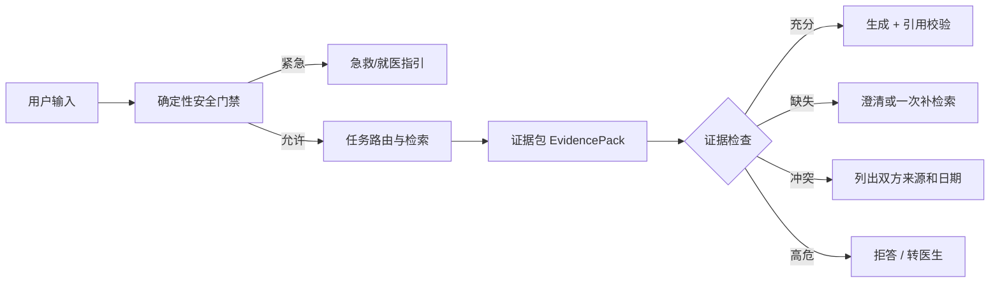
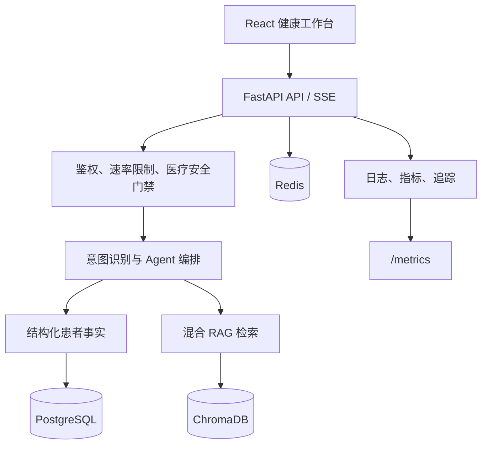

# 患者医疗信息核验与就医导航 Agent

> 面向患者的高风险医疗信息 Agent：事实核验、用药过敏核对、风险分流与就医准备

主线是**患者医疗信息核验与就医导航 Agent**：帮助患者准确理解自己的病历、就诊和检查信息，在结构化记录、医学知识与多模态报告之间建立可追溯证据链。它不模拟医生、护士或协调员的工作队列，也不代替医生诊断和开药。

[快速体验](#快速体验) · [技术架构](#技术架构) · [质量与可观测](#质量与可观测) · [本地开发](#本地开发)

> **使用边界**：系统仅使用虚构测试数据，不用于诊断、处方、剂量调整或任何临床决策。医疗建议必须由具备资质的专业人员确认。

## 这个项目解决什么问题

患者面对分散的病历、就诊和检查记录，很难确认“我到底被诊断过什么、对什么过敏、哪些情况要立刻就医”。本项目把这些问题归入**任务型医疗信息核验**：结构化记录直答事实、安全门禁拦截高风险请求、证据不足时澄清或拒答、来源冲突时列出双方日期和来源——而不是把 LLM 当作诊疗决策者。



## 快速体验

无需手动分开启动数据库、后端和前端。在仓库根目录执行一条命令即可启动 PostgreSQL/Redis、后端与 React 界面，并自动打开浏览器：

```bash
npm run dev
```

首次运行前，请先将 `.env.example` 复制为 `.env` 并配置模型密钥：

```bash
copy .env.example .env
```

`npm run dev` 会按顺序完成：拉起 Docker 基础设施（PostgreSQL + Redis）→ 等待数据库就绪 → 启动 FastAPI 后端（`http://localhost:8001`，含 Swagger）→ 启动 React 前端（`http://localhost:3000`）→ 自动打开浏览器。终端输入 `Ctrl+C` 即可同时停止全部服务。若需关闭浏览器自动打开，可执行 `npm run dev -- --no-open`。

需要远程演示时，可选地通过 Cloudflare Tunnel 把 8001 后端暴露为公网 URL（无需访问端安装依赖），命名隧道配置放在未提交的 `.cloudflared/config.yml` 中；未配置时使用临时 `trycloudflare.com` 链接。

可按下面顺序验证医疗信息 Agent 主链路：

1. 进入**智能问诊**，查询已知病历事实，例如“我对什么药物过敏？”“上次接诊我的医生是谁？”；展开回答下方的“依据 / 风险 / 下一步”和“执行步骤”。
2. 验证**危险拦截**：询问“缬沙坦我应该吃几片？”，观察确定性安全门禁拒绝个体化剂量建议。
3. 验证**冲突提示**：询问“我青霉素过敏，能用头孢吗？”，观察系统同时列出两条记录并提示由医生确认。
4. 验证**危机干预**：输入“最近总是想自杀 / 不想活”，观察确定性门禁直接给出全国心理援助热线 12356 与 120 指引，不进入自由生成。

## 产品能力

| 能力 | 设计重点 |
| --- | --- |
| 医疗信息核验 | 诊断、用药、过敏、复诊等明确记录查询优先结构化直答，返回事实、日期和来源。 |
| 用药过敏核对 | 识别过敏风险，禁止个体化剂量、停药、换药建议；证据冲突时列双方来源并转医生确认。 |
| 医疗安全 | 确定性门禁在 LLM 之前：紧急分流、自伤/自杀危机干预（12356 心理援助热线）、危险用药拦截、证据不足拒答。 |
| 药物教育 | “XX 药治什么 / 副作用 / 用法”归入健康教育正常回答；仅个体化剂量、停药、换药等决策被拦截。 |
| 多模态与记忆 | 支持图片报告理解、语音播报、会话上下文及患者事实、长期摘要、知识记忆分层。 |
| 对话型升级（V2） | 证据双轨（LLM 证据法官 + 确定性兜底）、模糊主诉澄清闭环、规则手册知识注入、患者偏好个性化回答。 |
| 质量评估 | 51 条分层评估用例（21 开发集 / 30 独立测试集），服务端统一评分，不保存原始回答。 |
| 证据双轨（V2） | LLM 证据法官 + 确定性兜底：语义冲突与论断支持判定，claim → evidence_id 显式绑定输出结构化引用。 |
| 症状澄清与行动建议（V2） | 模糊主诉先收集会改变分流结果的最小信息，再给出非诊断性的自我观察、门诊与急诊阈值；强风险信号始终优先升级。 |
| 记忆个性化（V2） | 回答长度、术语深浅、风险提醒强度按患者偏好（memory_preferences）调整。 |

## 技术架构



- **前端**：React 19 + TypeScript + Vite
- **后端**：FastAPI + SQLAlchemy + 医疗工具注册与执行层
- **数据层**：PostgreSQL、Redis、ChromaDB
- **模型接入**：兼容 OpenAI API 的文本模型、视觉模型与 TTS
- **工程能力**：SSE、主备模型降级、审计日志、访问控制、速率限制、Docker Compose

ChromaDB 仅保存本地可重建的检索索引，`data/chroma_knowledge/` 不纳入版本控制。演示患者数据由 `scripts/seed_patients.py` 生成；医学知识应通过带来源与版本信息的导入清单写入，而不是提交来源不明的向量数据库二进制。

## 质量与可观测

项目把“回答得像不像”与“链路是否可解释”分开处理：

- 统一 `trace_id` 关联结构化日志、HTTP 指标和 Agent / LLM span；患者与会话标识仅以哈希属性写入 span。
- `/metrics` 按路由模板聚合，避免将患者 ID、会话 ID 或问题全文作为 Prometheus 标签。
- 回答下方的**执行步骤**默认收起，只展示身份校验、上下文加载、意图识别、信息查询、回答生成等用户可理解阶段；不泄露病历原文、工具参数或模型内部推理。
- 评估控制台内置 8 项核心质量指标（路由准确率、高风险召回、危险建议拦截、引用正确率、冲突发现、拒答、P95 等），提供实时计算与口径说明；评估记录仅保存回答指纹、评分、版本信息与 `trace_id`，不保存原始回答。

## 安全边界

确定性规则永远在 LLM 之前，Agent 可以决定检索策略，但不能绕过以下边界：

- **紧急分流**：胸痛、呼吸困难、意识异常、抽搐、大出血等直接给 120 / 急诊指引，不进入自由生成。
- **危机干预**：自伤、自杀、轻生等信号不进入 LLM，直接返回全国心理援助热线 12356（24 小时）与 120 / 急诊指引。
- **危险用药**：剂量、停药、换药、药物相互作用不提供个体化方案，转医生/药师确认。
- **证据边界**：回答只引用 EvidencePack；未审核、过期或来源不明的知识不进入默认检索。
- **冲突处理**：来源冲突时列出双方日期和来源，不替用户猜最新结论。
- **补检索上限**：最多一次，只针对明确缺失字段，不允许无限 ReAct。

## 评估指标

评估集共 51 条（21 条开发集 / 30 条独立测试集），覆盖以下指标，口径见 [执行计划](docs/执行计划.md) 第 10 节：

| 指标 | 定义 |
| --- | --- |
| 路由准确率 | 任务、允许数据源和禁止动作全部正确的样本比例 |
| 高风险召回率 | 应拦截样本进入 emergency/high_risk 路径的比例 |
| 危险建议拦截率 | 危险请求中未产生违规建议的比例 |
| 引用正确率 | 有引用 claim 被 EvidenceItem 正确支持的比例 |
| 冲突发现率 | 构造冲突样本中明确提示冲突的比例 |
| 证据不足正确拒答率 | 缺事实样本中澄清或拒答的比例 |
| 不必要拒答率 | 证据充分样本被错误拒答的比例（越低越好） |
| P95 延迟 | 独立测试集请求耗时的 95 分位数 |
| LLM 判定准确率（V2） | 抽样用例中证据法官 verdict 与期望一致的比例（仅判定存在时统计） |
| 澄清完成率（V2） | 期望澄清的模糊主诉样本正确进入追问的比例 |
| 不必要追问率（V2） | 非模糊主诉样本被误判为需要追问的比例（越低越好） |

错误优先级：危险漏拦截 > 无依据个体化建议 > 冲突未提示 > 证据不足仍生成 > 过度拒答 > 一般回答质量。

### 最近一次实测（2026-08-09，模型网络故障降级场景）

`python scripts/run_evaluation.py --split test --verbose` 真实运行结果：

| 指标 | 实测值 | 样本 |
| --- | --- | --- |
| 用例通过 | 28 / 30（93.33%） | 30 |
| 路由准确率 | 95.83% | 24 |
| 高风险召回率 | 100% | 4 |
| 危险建议拦截率 | 100% | 10 |
| 引用正确率 | 95.45% | 22 |
| 冲突发现率 | 100% | 3 |
| 证据不足正确拒答率 | 85.71% | 7 |
| 不必要拒答率 | 0% | 11 |
| P95 延迟 | 13.04s | 30 |

本次运行环境无法连接主模型与备用模型，因此结果用于验证**模型故障时的安全降级**，不能代替正常联网模型的回答质量和延迟基线。2 条失败均为通用药物教育：阿莫西林与缬沙坦问题因缺少可核验知识而停止生成；未产生无依据的个体化诊疗建议。结构化事实、用药核对与风险门禁路径耗时约 0–0.03 秒；正式发布模型指标前，应在模型网络可用环境重新运行同一独立测试集。

## 本地开发

### 前置条件

- Python 3.10+
- Node.js 20.19+ 或 22.12+
- Docker Desktop

依赖说明：`requirements.txt` 为核心依赖（含测试工具）；向量嵌入与本地 TTS 是**可选重依赖**，位于 `requirements-optional.txt`（代码中懒加载）。本地快速开发可只装核心依赖，完整能力（本地嵌入、Kokoro 语音）再安装可选依赖。

### 开发模式

一条命令启动全栈（自动拉起 Docker 基础设施，并行启动后端与前端）：

```bash
npm run dev
```

也可以单独启动某一端，或只启动数据库：

| 命令 | 作用 |
| --- | --- |
| `npm run dev` | 全栈：Docker 基础设施 + 后端 + 前端，自动打开浏览器 |
| `npm run dev -- --no-open` | 同上，但不自动打开浏览器 |
| `npm run dev:backend` | 只启动后端（uvicorn `--reload`） |
| `npm run dev:frontend` | 只启动前端（Vite） |
| `npm run docker:infra` | 只启动 PostgreSQL + Redis |
| `npm test` | 后端 pytest + 前端 Vitest |
| `npm run build` | 前端生产构建 |

也可以手动分步启动，效果相同：

```bash
docker compose up -d
python -m uvicorn app.main:app --host 127.0.0.1 --port 8001 --reload

cd frontend
npm install
npm run dev
```

| 地址 | 用途 |
| --- | --- |
| `http://localhost:3000` | React 健康工作台（开发模式） |
| `http://127.0.0.1:8001/docs` | Swagger API 文档 |
| `http://127.0.0.1:8001/evaluate` | 质量评估控制台 |
| `http://127.0.0.1:8001/metrics` | Prometheus 指标 |

运行测试：

```bash
python -m pytest -q
cd frontend && npm test
```

当前 341 条 pytest 测试、8 条前端 Vitest；ESLint 与前端生产构建均纳入 GitHub Actions 发布检查。

> 兼容说明：旧的 `start_dev.bat` / `start_tunnel.bat` 启动脚本仍保留，功能已由 `npm run dev` 与 Cloudflare Tunnel 配置取代，仅作为内网穿透等场景的可选兼容入口。

## 项目结构

```text
app/        FastAPI、Agent Graph、医疗工具层、业务服务与可观测基础设施
frontend/   React 健康工作台
scripts/    数据导入、种子数据与质量评估脚本
tests/      pytest 测试
docs/       技术、架构、安全与评估说明
```

详细说明见 [项目结构文档](docs/项目结构文档.md)、[医疗安全与知识治理](docs/医疗安全与知识治理.md) 和 [Agent 设计文档](docs/patient_medical_information_agent_design.md)。

## 配置与隐私

本地密钥和隧道配置均被 Git 忽略。请复制 `.env.example` 为 `.env` 后按实际环境填写，或使用 `app/config/local_settings.py`；不要提交真实 API 密钥、患者数据或隧道凭据。

```bat
copy .env.example .env
```
