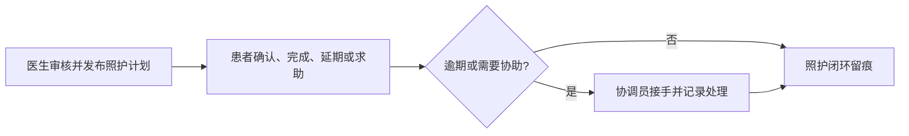

# 患者照护助手

> 从“问答”走到“照护执行”的患者端协同助手

医生审核发布照护计划，患者完成或求助，协调员跟进异常；AI 问诊只是健康工作台中的一个受安全边界约束的模块。

[三分钟演示](#三分钟演示) · [技术架构](#技术架构) · [质量与可观测](#质量与可观测) · [本地开发](#本地开发)

> **演示原型声明**：系统仅使用虚构演示数据，不用于诊断、处方、剂量调整或任何临床决策。医疗建议必须由具备资质的专业人员确认。

## 这个项目解决什么问题

患者在出院或就诊后，常常只拿到分散的医嘱：何时复诊、该做什么检查、哪些情况需要求助。这个项目把明确的照护安排转成**可确认、可追踪、可协作升级**的任务，而不是把 LLM 当作诊疗决策者。



## 三分钟演示

这是给面试官或评审最合适的体验方式：运行一次脚本，终端会输出可分享的 Cloudflare URL；将该链接发给对方即可，无需对方安装环境。首次演示前，请先将 `.env.example` 复制为 `.env` 并配置你自己的模型密钥。

```bat
start_tunnel.bat
```

脚本会启动 PostgreSQL 和 Redis、构建 React 界面、以 `DEMO_MODE=true` 准备虚构病例、启动 8001 后端，并将完整界面通过 Cloudflare Tunnel 暴露出去。

建议按下面顺序体验：

1. 选择**医生**角色，审核并发布基于出院随访记录生成的照护计划。
2. 切换到**患者**角色，确认待办、标记完成、延期或发起“需要帮助”。
3. 切换到**协调员**角色，查看协作队列、接手并记录解决结果。
4. 进入**智能问诊**，查询已知病历事实；展开回答下方的“执行步骤”，查看面向用户的链路摘要。

Cloudflare 未配置命名隧道时，脚本会打印临时 `trycloudflare.com` 链接；窗口保持运行期间链接有效。命名隧道配置放在未提交的 `.cloudflared/config.yml` 中。

## 产品能力

| 能力 | 设计重点 |
| --- | --- |
| 照护闭环 | 医生审核发布 → 患者执行 → 协调员协作，任务状态和处理事件均可追溯。 |
| 智能问诊 | 明确的诊断、用药、过敏、复诊等事实优先从结构化记录直答；复杂问题才进入 Agent + RAG。 |
| 医疗安全 | 紧急症状与高风险个体化用药建议前置拦截；系统不生成处方、剂量或停药方案。 |
| 多模态与记忆 | 支持图片报告理解、语音播报、会话上下文及患者事实、长期摘要、知识记忆分层。 |
| 质量评估 | 15 条集中管理的评估用例，服务端统一评分，保存版本化评分与趋势，不保存原始回答。 |

## 技术架构

```mermaid
flowchart TB
    UI[React 健康工作台] --> API[FastAPI API / SSE]
    API --> Guard[鉴权、速率限制、医疗安全门禁]
    Guard --> Router[意图识别与 Agent 编排]
    Router --> Facts[结构化患者事实]
    Router --> RAG[混合 RAG 检索]
    Facts --> PG[(PostgreSQL)]
    RAG --> Vector[(ChromaDB)]
    API --> Redis[(Redis)]
    API --> Obs[日志、指标、追踪]
    Obs --> Metrics[/metrics]
```

- **前端**：React 18 + TypeScript + Vite
- **后端**：FastAPI + SQLAlchemy + MCP 工具编排
- **数据层**：PostgreSQL、Redis、ChromaDB
- **模型接入**：兼容 OpenAI API 的文本模型、视觉模型与 TTS
- **工程能力**：SSE、主备模型降级、审计日志、访问控制、速率限制、Docker Compose

## 质量与可观测

项目把“回答得像不像”与“链路是否可解释”分开处理：

- 统一 `trace_id` 关联结构化日志、HTTP 指标和 Agent / LLM span；患者与会话标识仅以哈希属性写入 span。
- `/metrics` 按路由模板聚合，避免将患者 ID、会话 ID 或问题全文作为 Prometheus 标签。
- 回答下方的**执行步骤**默认收起，只展示身份校验、上下文加载、意图识别、信息查询、回答生成等用户可理解阶段；不泄露病历原文、工具参数或模型内部推理。
- 运行 `python scripts/run_evaluation.py --verbose` 可执行评估集；评估记录仅保存回答指纹、评分、版本信息与 `trace_id`。

## 本地开发

### 前置条件

- Python 3.10+
- Node.js 18+
- Docker Desktop

### 开发模式

```bat
docker compose up -d
python -m uvicorn app.main:app --host 127.0.0.1 --port 8001 --reload

cd frontend
npm install
npm run dev
```

| 地址 | 用途 |
| --- | --- |
| `http://localhost:3000` | React 健康工作台（开发模式） |
| `http://127.0.0.1:8001/docs` | Swagger API 文档 |
| `http://127.0.0.1:8001/evaluate` | 质量评估控制台 |
| `http://127.0.0.1:8001/metrics` | Prometheus 指标 |

运行测试：

```bat
python -m pytest -q
```

## 项目结构

```text
app/        FastAPI、Agent/MCP、业务服务、数据模型与可观测基础设施
frontend/   React 健康工作台
scripts/    数据导入、种子数据与质量评估脚本
tests/      pytest 测试
docs/       技术、架构与面试说明
```

详细说明见 [项目结构文档](docs/项目结构文档.md)、[医疗安全与知识治理](docs/医疗安全与知识治理.md) 和 [面试技术文档](docs/面试技术文档.md)。

## 配置与隐私

本地密钥和隧道配置均被 Git 忽略。请复制 `.env.example` 为 `.env` 后按实际环境填写，或使用 `app/config/local_settings.py`；不要提交真实 API 密钥、患者数据或隧道凭据。

```bat
copy .env.example .env
```
